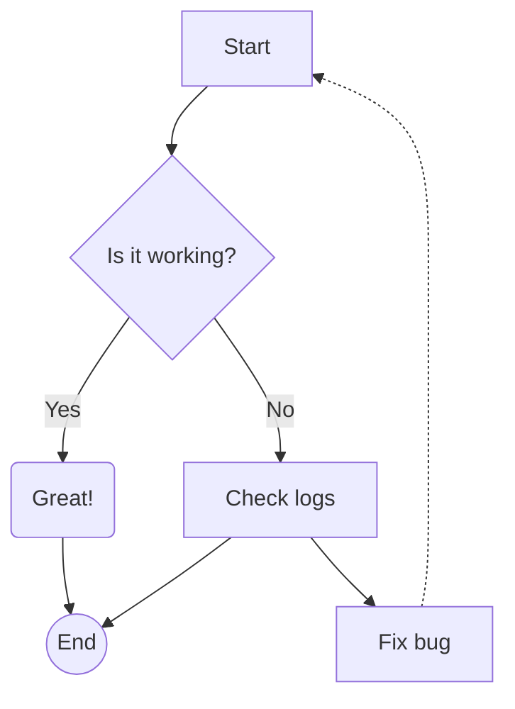
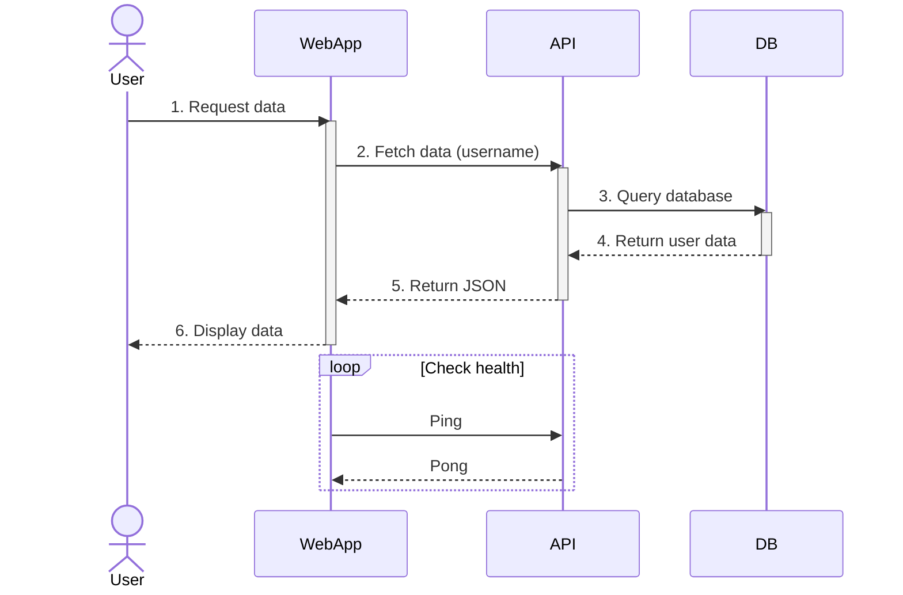
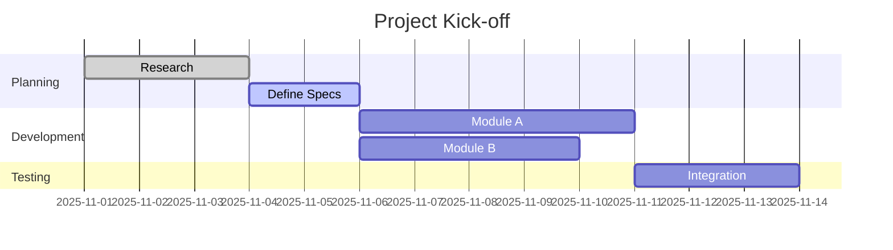
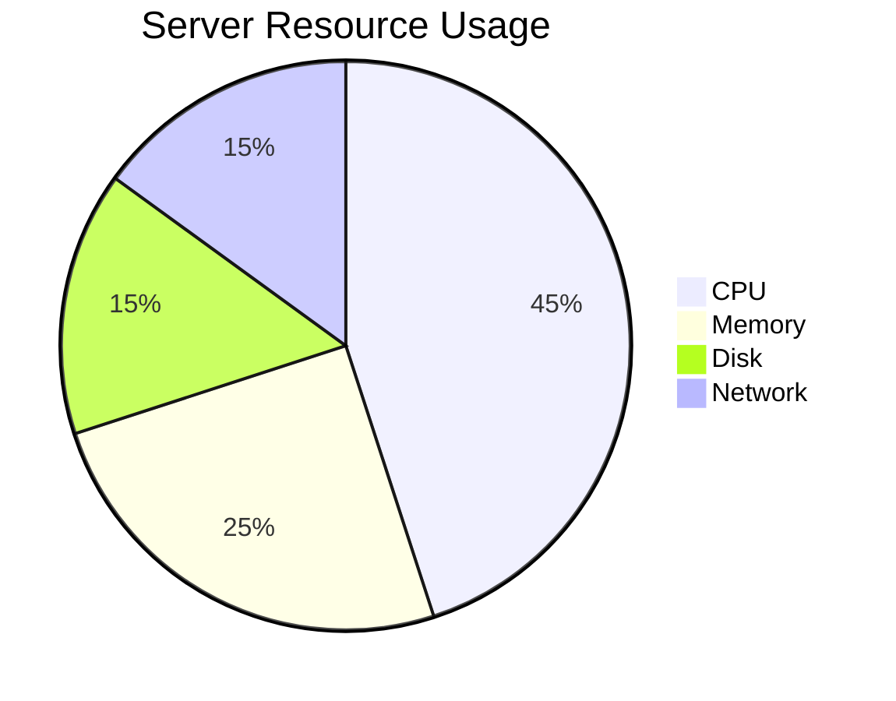
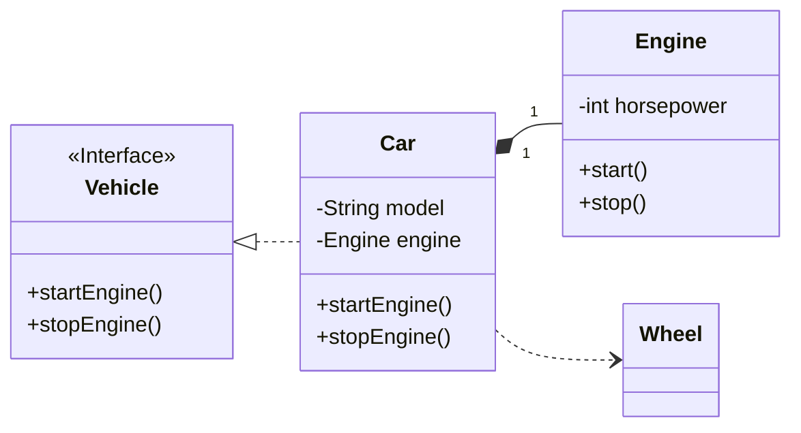
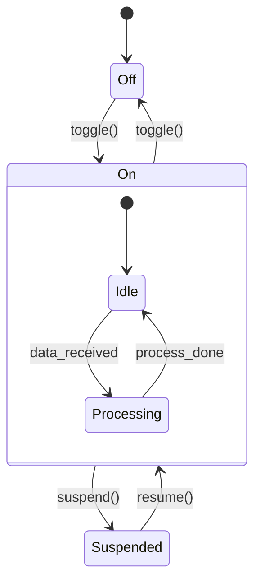
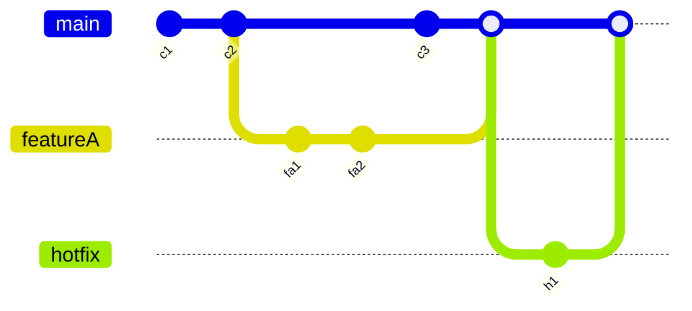
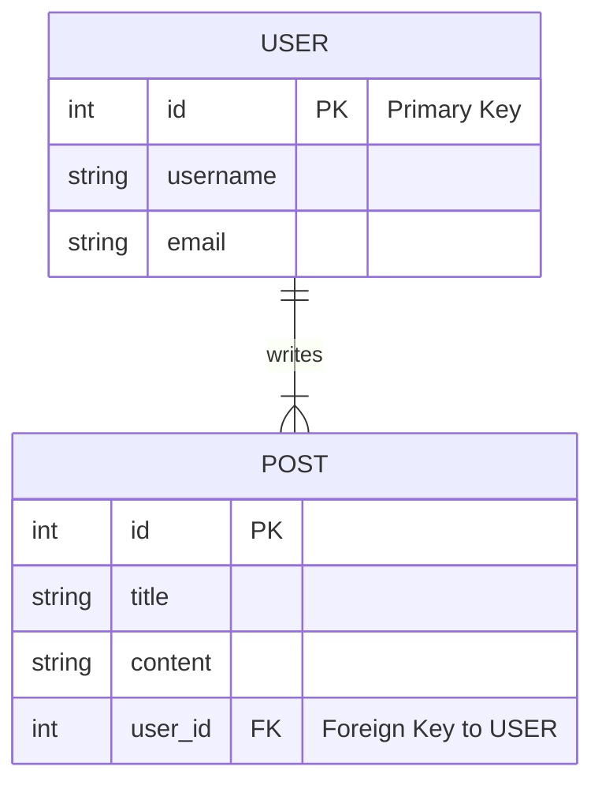

# graph

```mermaid
graph TD
    A[Start] --> B{Is it working?};
    B -- Yes --> C(Great!);
    B -- No --> D[Check logs];
    D --> E[Fix bug];
    E -.-> A;
    C --> F((End));
    D --> F;
```
## sequenceDiagram

```mermaid
sequenceDiagram
    actor User
    participant WebApp
    participant API
    participant DB

    User->>WebApp: 1. Request data
    activate WebApp
    WebApp->>API: 2. Fetch data (username)
    activate API
    
    API->>DB: 3. Query database
    activate DB
    DB-->>API: 4. Return user data
    deactivate DB
    
    API-->>WebApp: 5. Return JSON
    deactivate API
    WebApp-->>User: 6. Display data
    deactivate WebApp

    loop Check health
        WebApp->>API: Ping
        API-->>WebApp: Pong
    end
```

## gantt

```mermaid
gantt
    title Project Kick-off
    dateFormat  YYYY-MM-DD
    
    section Planning
    Research     :done,    des1, 2025-11-01, 3d
    Define Specs :active,  des2, 2025-11-04, 2d
    
    section Development
    Module A     :         des3, after des2, 5d
    Module B     :         des4, after des2, 4d
    
    section Testing
    Integration  :         des5, after des3 and des4, 3d
```
## pie

```mermaid
pie
    title Server Resource Usage
    "CPU" : 45
    "Memory" : 25
    "Disk" : 15
    "Network" : 15
```

```mermaid
classDiagram
    direction LR
    
    class Vehicle {
        <<Interface>>
        +startEngine()
        +stopEngine()
    }
    
    class Car {
        -String model
        -Engine engine
        +startEngine()
        +stopEngine()
    }

    class Engine {
        -int horsepower
        +start()
        +stop()
    }

    Vehicle <|.. Car  
    Car "1" *-- "1" Engine 
    Car ..> Wheel      
```

```mermaid
stateDiagram-v2
    [*] --> Off
    
    Off --> On : toggle()
    On --> Off : toggle()
    
    On --> Suspended : suspend()
    Suspended --> On : resume()
    
    state On {
        [*] --> Idle
        Idle --> Processing : data_received
        Processing --> Idle : process_done
    }
```

```mermaid
gitGraph
    commit id: "c1"
    commit id: "c2"
    
    branch featureA
    checkout featureA
    commit id: "fa1"
    commit id: "fa2"
    
    checkout main
    commit id: "c3"
    merge featureA
    
    branch hotfix
    checkout hotfix
    commit id: "h1"
    
    checkout main
    merge hotfix
```

```mermaid
erDiagram
    USER {
        int id PK "Primary Key"
        string username
        string email
    }
    
    POST {
        int id PK
        string title
        string content
        int user_id FK "Foreign Key to USER"
    }
    
    USER ||--|{ POST : "writes" 
```
