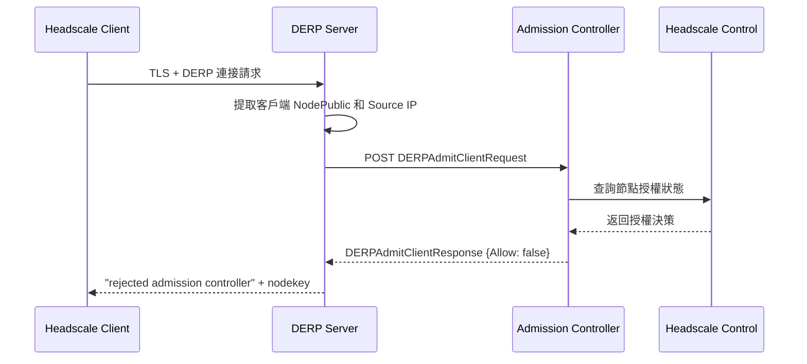

```mermaid
sequenceDiagram
    participant C as Headscale Client
    participant D as DERP Server
    participant A as Admission Controller
    participant H as Headscale Control
    
    C->>D: TLS + DERP 連接請求
    D->>D: 提取客戶端 NodePublic 和 Source IP
    D->>A: POST DERPAdmitClientRequest
    A->>H: 查詢節點授權狀態
    H-->>A: 返回授權決策
    A-->>D: DERPAdmitClientResponse {Allow: false}
    D-->>C: "rejected admission controller" + nodekey
```
